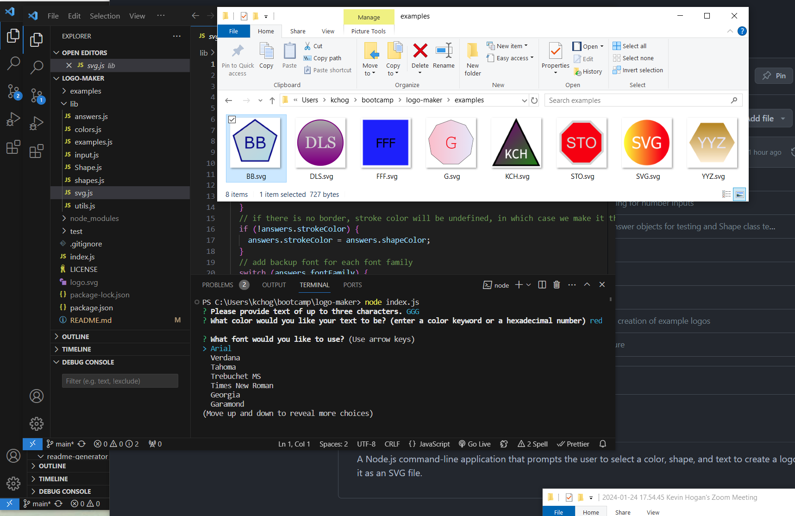

# Logo Maker

## Description
A Node.js command-line application that prompts the user to select a color, shape, and text to create a logo and save it as an SVG file.  

## Table of Contents

- [Installation](#installation)
- [Usage](#usage)
- [Credits](#credits)
- [License](#license)
- [How to Contribute](#guidelines)
- [Tests](#tests)
- [Questions](#questions)

## Installation

* After cloning the repo, please run 'npm install' to get the dependent modules (e.g. inquirer, jest, etc.).

## Usage

After the modules are installed, run by typing 'node index.js' or 'npm start' from the terminal.  You will then be prompted with a series of logo design questions.
* -e will generate SVG's for every 'answers' object in answers.js
* -o will send the answers object to console after your inputs so that you can add to the answers.js more easily.

[Demo Video](https://youtu.be/oE1PGlgjDGE)

## Credits

N/A

## License

This application is covered under the MIT License.

## How To Contribute

If you choose to contribute, please refer to the [Contributor Covenant](https://www.contributor-covenant.org/) for guidelines.

## Tests

After installing jest (with 'npm install') run 'npm test' to run automated tests.

## Questions

[GitHub Profile](https://github.com/kevinchogan)

For questions, please contact kchogan@pacbell.net.
